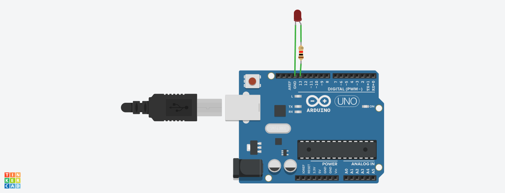

# Blink LED Arduino Project

This Arduino project demonstrates how to blink an LED using an Arduino board.

## Components Used
- Arduino Uno
- LED (any color)
- Resistor (220-330 ohms)
- Jumper wires

## Circuit Diagram

The circuit diagram shows how to connect the components to your Arduino board.

## Arduino Code
The `Blink.ino` file contains the Arduino code for blinking the LED.
