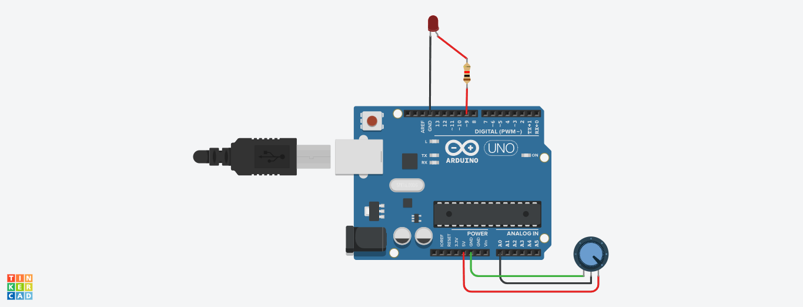

# Adjusting LED brightness with Potentiometer

This Arduino project reads the value from a potentiometer using an analog input pin and maps it to control the brightness of an LED connected to an analog output pin. The potentiometer allows you to vary the LED's brightness by adjusting its knob.

## Circuit Diagram

## Components Used

- Arduino UNO
- Potentiometer
- LED
- Resistors 
- Jumper wires
- Breadboard (optional)

## Installation and Setup

1. Connect one end of the potentiometer to the 5V output on the Arduino.
2. Connect the other end of the potentiometer to the ground (GND) on the Arduino.
3. Connect the middle pin (wiper) of the potentiometer to analog pin A0 on the Arduino.
4. Connect one leg of the LED to digital pin 9 on the Arduino.
5. Connect the other leg of the LED to a current-limiting resistor and then to ground (GND) on the Arduino.
6. Ensure that the LED's anode (longer leg) is connected to pin 9 and the cathode (shorter leg) to ground.
7. Upload the provided Arduino sketch to your board.
8. Open the Serial Monitor in the Arduino IDE to view the values read from the potentiometer and the corresponding LED brightness.
9. Turn the potentiometer's knob to see how it affects the LED's brightness.
    
**Note:** The same method can be applied to various IoT applications where precise motor control is required.
