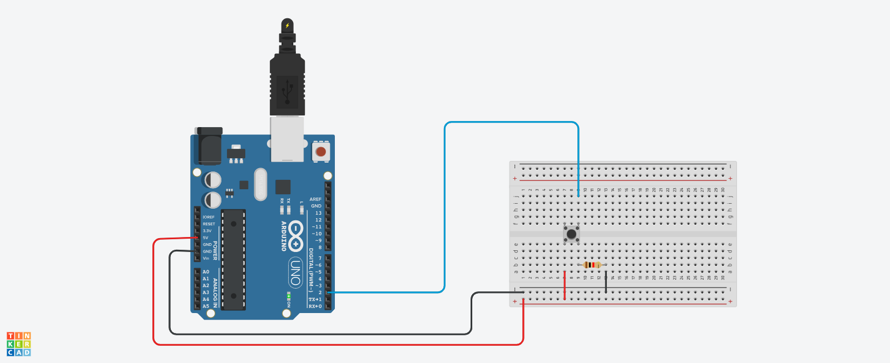

# Arduino PushButton State Reader

This Arduino project demonstrates how to read the state of a push button using digital pin 2 and print the result to the Serial Monitor.

## Setup Procedure

Follow these steps to set up and run the project:

1. **Hardware Requirements:**
   - Arduino board (e.g., Arduino Uno)
   - A push button with at least two terminals
   - Connecting wires
   - Resistor
2. **Connection:**
   - Connect a red wire to the 5V supply on the Arduino and connect a black wire to the ground (GND) on the Arduino. Insert the other ends of these wires into the two long vertical rows on the side of the breadboard.
   - Use a third wire to connect digital pin 2 on the Arduino to one leg of the pushbutton.
   - Connect a 10k ohm pull-down resistor from the same leg of the pushbutton to the ground rail on the breadboard.
   - Connect the other leg of the push button to the 5V supply on the breadboard.
When the push button is unpressed (open), it connects the pin to ground (through the pull-down resistor), resulting in a LOW reading. When the button is pressed (closed), it connects the pin to 5 volts, resulting in a HIGH reading.

## Code

The Arduino sketch included in this repository, `DigitalReadSerial.ino`, provides the code for this example. You can upload it to your Arduino board using the Arduino IDE.

## Circuit Diagram

